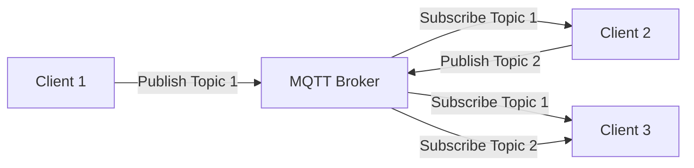
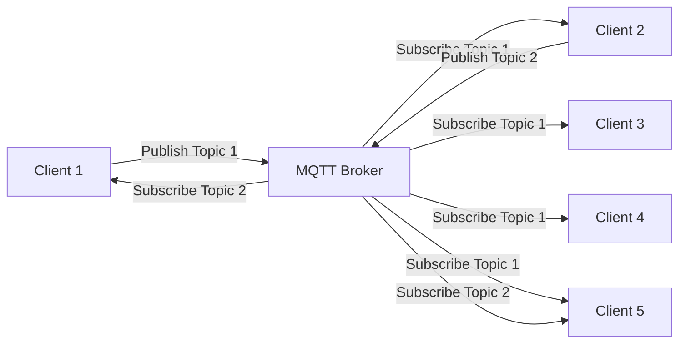

# mqttstarterkit

This repository contains the necessary files to implement MQ Telemetry Transport (MQTT) on a Raspberry Pi. 

## Hardware Information
Hardware: **Raspberry Pi 4 Model B** <br>
OS: **Raspbian Wheezy/Jessie/Stretch/Buster**

## Installation
### MQTT Broker
Execute the following command to install **MQTT Broker** function into your Raspberry Pi.

Install mosquitto server
```
sudo apt install -y mosquitto
```

To check/edit mqtt services
```
sudo systemctl status mosquitto.service
sudo systemctl start mosquitto.service
sudo systemctl stop mosquitto.service
```

### MQTT Client
Execute the following command to install **MQTT Client** function into your Raspberry Pi.

Install MQTT client
```
sudo apt install -y mosquitto-clients
```

### Running MQTT python script

To run python mqtt script, please install
```
sudo pip3 install paho-mqtt
```

If pip3 is not already installed
```
sudo apt install python3-pip
```

## MQTT Flowchart (Example)
### 3 Clients Example



### 5 Clients Example
